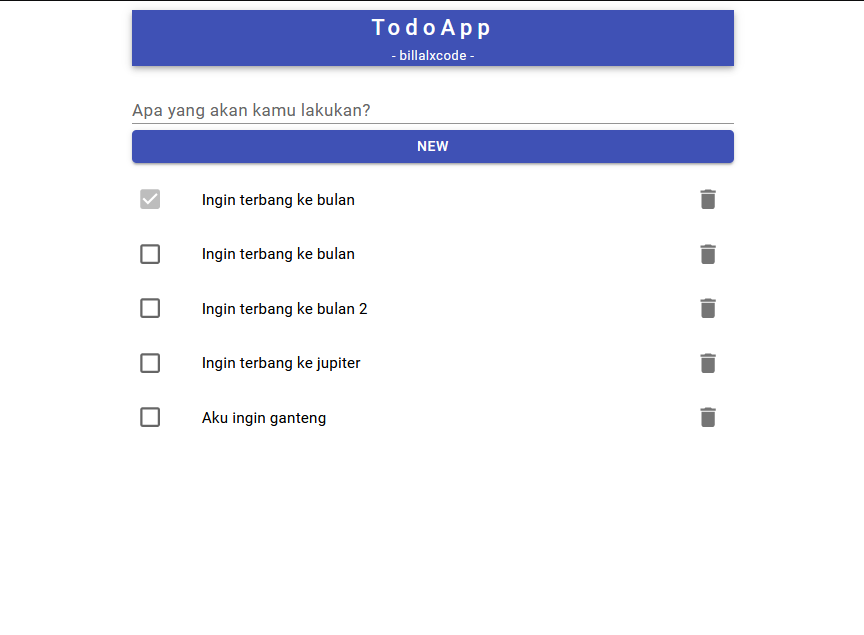

# Todo App
Todo (To Do) adalah aplikasi yang dirancang untuk memanajemen tugas yang dapat kamu akses melalui web. Aplikasi ini membantu kamu untuk mengetahui pekerjaan-pekerjaan mana yang belum dilakukan. Sehingga, kegiatanmu menjadi lebih rapi sebab adanya To Do List.

### `Warning:` aplikasi ini merupakan media pembelajaran
 Repo ini merupakan media pembelajaran backend menggunakan bahasa [Go](https://go.dev)

## Cara install server
`Warning`: jika kamu belum install bahasa [Go](https://go.dev) silahkan lihat [Download and Install](https://go.dev/doc/install)

- Masuk ke direktori yang bernama `go-server`, dimana direktori ini merupakan direktori rest api yang dibuat menggunakan bahasa [Go](https://go.dev) dan [Gin Web Framework](https://github.com/gin-gonic/gin)
- Install program bernama [Make](https://www.gnu.org/software/make/)
1. Linux:
```shell
sudo apt-get install make
```
2. Windows: [How to install "make" in Windows](https://stackoverflow.com/questions/32127524/how-to-install-and-use-make-in-windows)

- Jika anda ingin langsung menjalankan server, gunakan perintah berikut
```shell
# kode akan langsung dijalankan
make run
```
- Jika anda ingin compile ke executable, gunakan perintah berikut
```shell
# kode akan menjadi executable
make build
```

Server akan jalan di [localhost:1412](http://localhost:1412)

## Cara install client
`Warning`: jika kamu belum install bahasa [Nodejs](https://nodejs.org) silahkan lihat [Download](https://nodejs.org/en/download)

- Masuk ke direktori yang bernama `todo-app`, dimana direktori ini merupakan direktori frontend yang dibuat menggunakan bahasa [Nodejs](https://nodejs.org) dan [Nextjs](https://nextjs.org)
- Install pustaka dengan mengetik perintah
```shell
npm i
```
- Jalan program dengan menggunakan perintah
```shell
npm run dev
```

## Screenshoot
